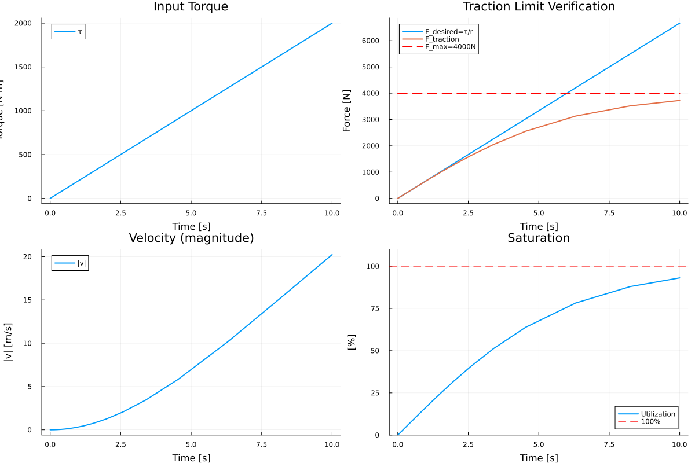
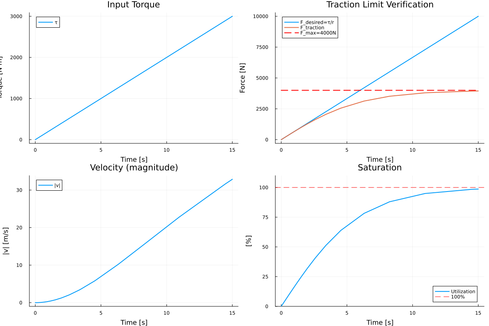
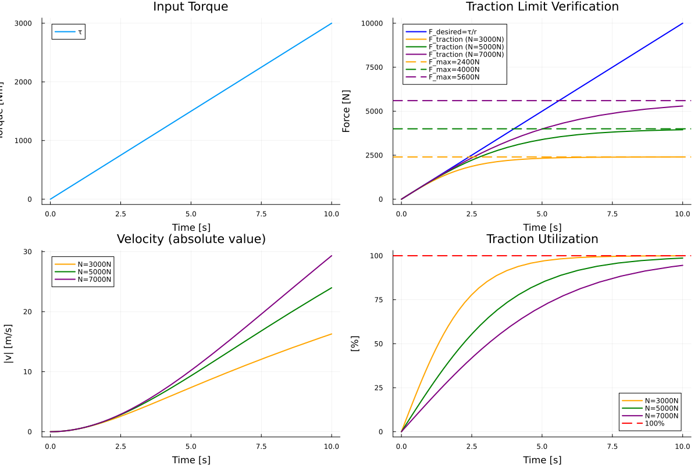

# Wheel Component - Project by Luuk Milo van Breugel
This document contains all the validations by me ( Luuk Milo van Breugel ) for the ESPD project.

## Phase 1

### Test 1 - Traction Limit Verification
    Verifying that traction limit F_max = μ·N: 
    radius r = 0.3 m, friction μ = 0.8
    Apply constant normal force N = 5000 N -> F_max = 4000 N
    Apply varying torque (ramp or step)
    -> Observe traction force saturation

F_max = μ·N = 0.8 × 5000 = 4000 N
- At low torque: F_traction = τ/r (linear relationship)
- At high torque: F_traction saturates at F_max = 4000 N
- Verify wheel doesn't produce more force than physically possible
- Example: τ = 2000 N·m → F_desired = 2000/0.3 = 6667 N → F_actual = 4000 N (limited!)

Saturation at 93.1% by end of simulation -> extra test with 0 - 3000 Nm

magnitude of velocity (is negative). Magnitude does only matter for this case

### Test 2: Load Transfer Effect on Traction
- At N = 3000 N: F_max = 0.8 × 3000 = 2400 N
- At N = 5000 N: F_max = 0.8 × 5000 = 4000 N
- At N = 7000 N: F_max = 0.8 × 7000 = 5600 N
- With same torque, traction force should scale with normal force

The traction force scales with the normal force:

N = 3000 N: F_max = 2400 N, 100% saturated, v = 16.3 m/s
N = 5000 N: F_max = 4000 N, 98.7% saturated, v = 24.0 m/s
N = 7000 N: F_max = 5600 N, 94.5% saturated, v = 29.3 m/s

### Test 3: Kinematic Verification (No Slip)

- Calculate expected relationship: v = ω·r
- Verify v/ω = r (error < 0.1%)
- Check power conservation: τ·ω = F·v (when not saturated)
- Verify no slip occurs when within traction limit

J=0

a lot of errors: start over with testwheelkinematics, WheelcontactBreakout (to original), and Wheel.dyad (changes)

