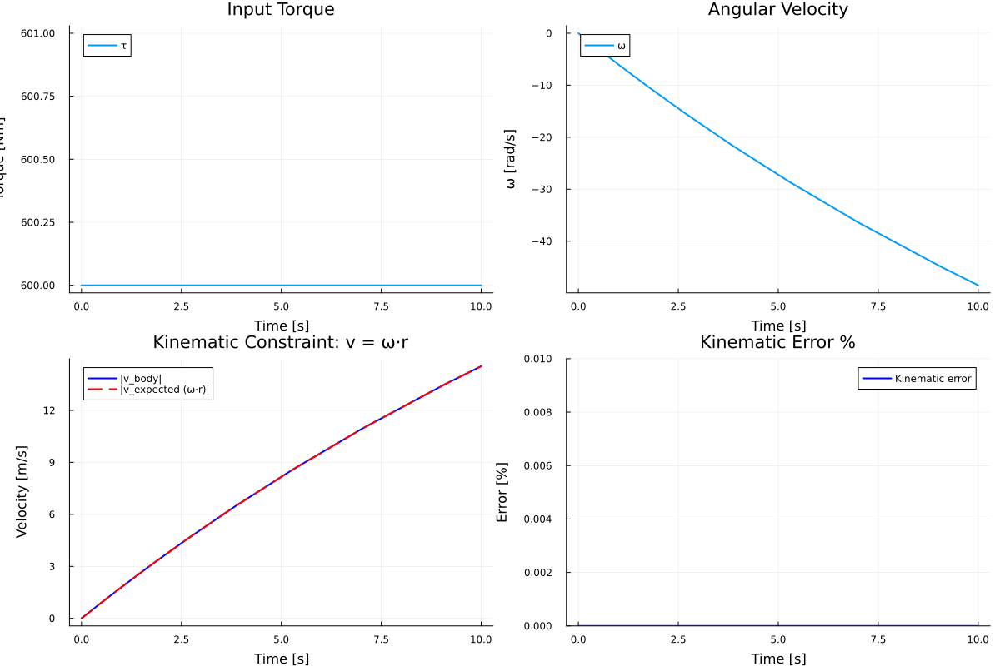
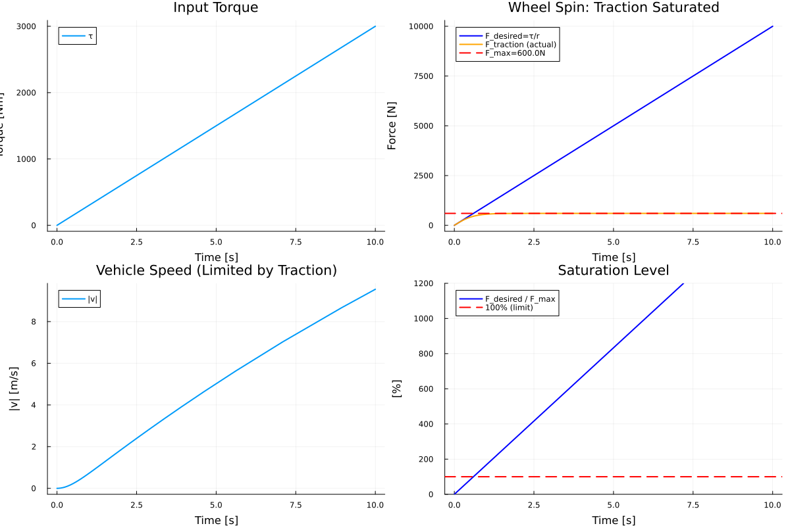
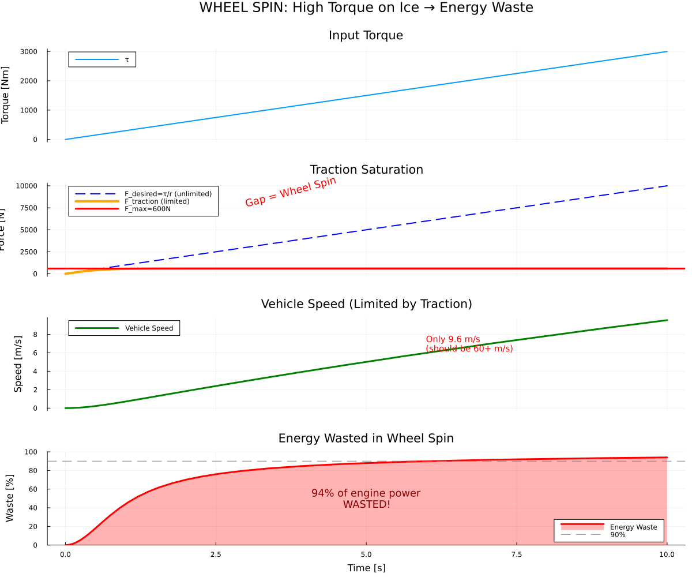
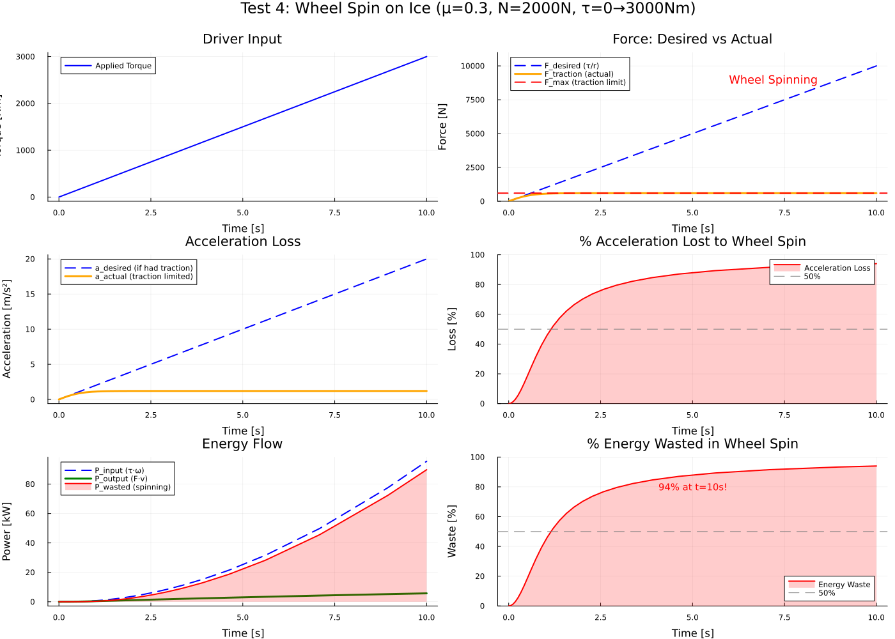
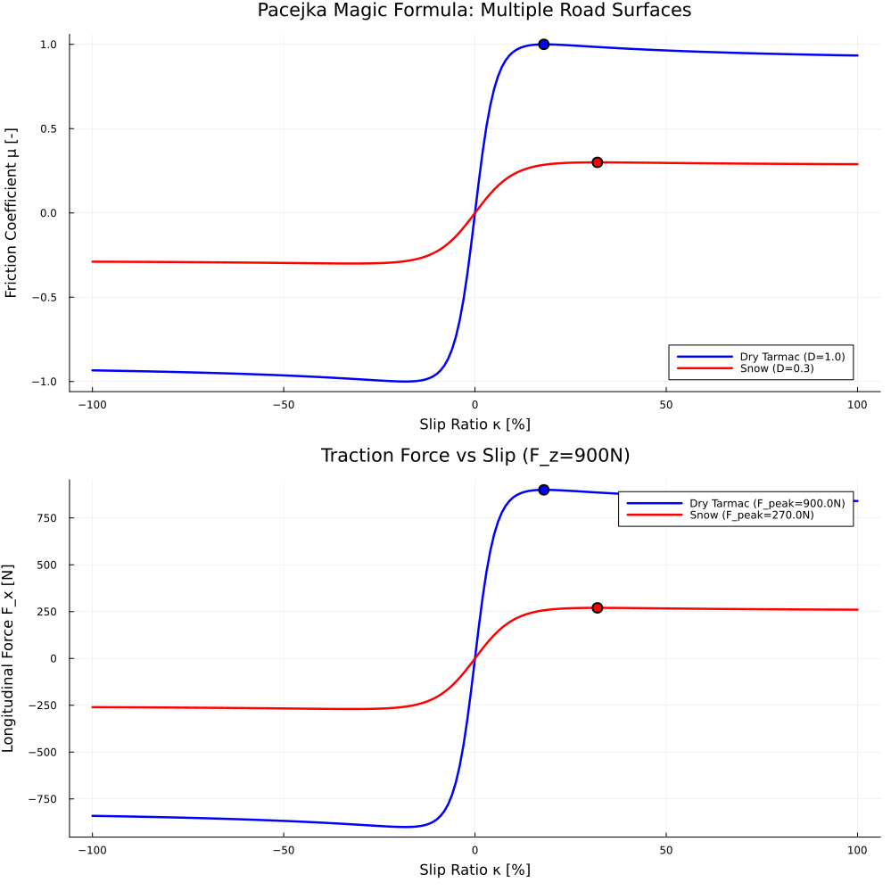
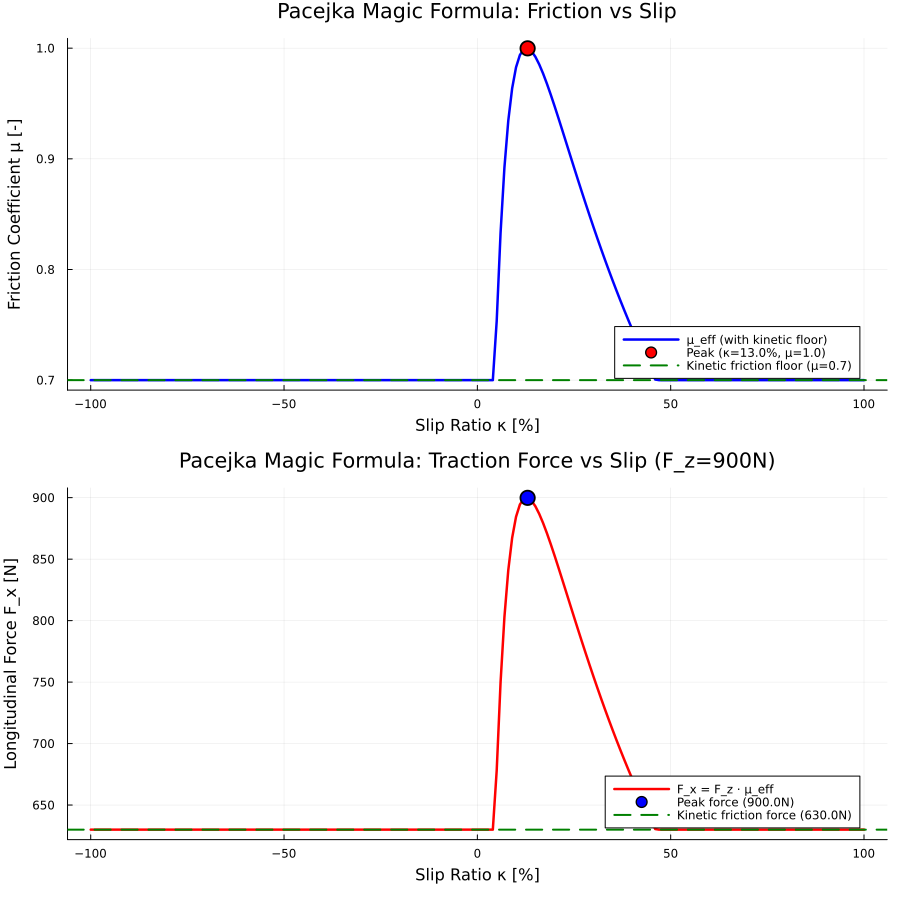
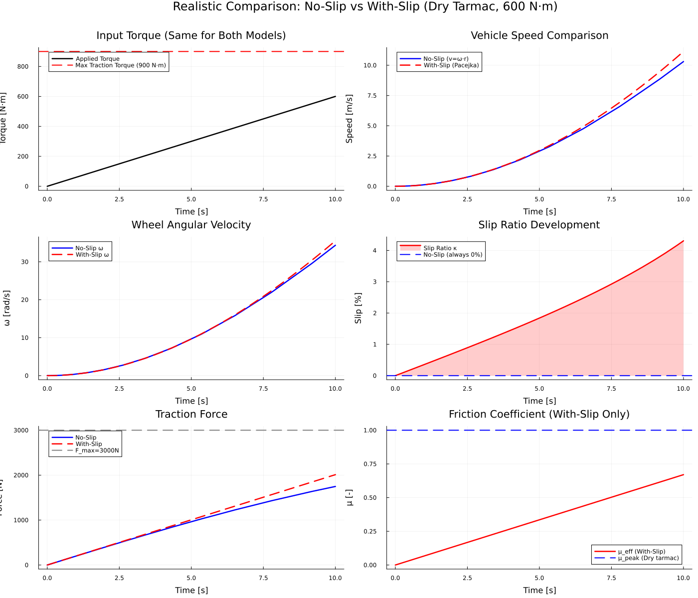
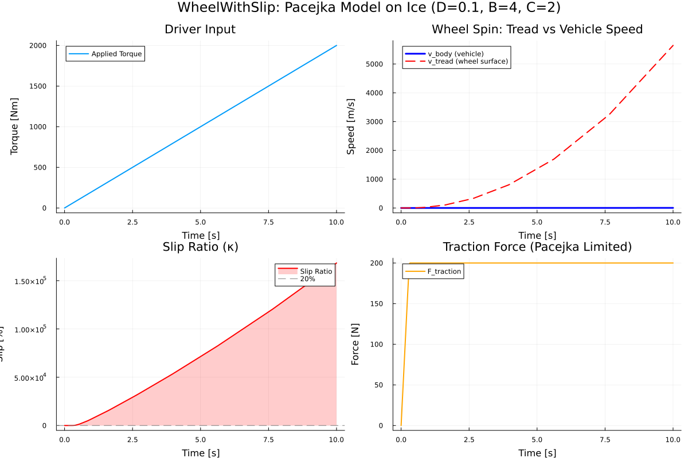

# Wheel Component - Project by Luuk Milo van Breugel
This document contains all the validations by me ( Luuk Milo van Breugel ) for the ESPD project.

## Phase 1

### Test 1 - Traction Limit Verification
    Verifying that traction limit F_max = μ·N: 
    radius r = 0.3 m, friction μ = 0.8
    Apply constant normal force N = 5000 N -> F_max = 4000 N
    Apply varying torque (ramp or step)
    -> Observe traction force saturation

F_max = μ·N = 0.8 × 5000 = 4000 N
- At low torque: F_traction = τ/r (linear relationship)
- At high torque: F_traction saturates at F_max = 4000 N
- Verify wheel doesn't produce more force than physically possible
- Example: τ = 2000 N·m → F_desired = 2000/0.3 = 6667 N → F_actual = 4000 N (limited!)

Saturation at 93.1% by end of simulation -> extra test with 0 - 3000 Nm

magnitude of velocity (is negative). Magnitude does only matter for this case

### Test 2: Load Transfer Effect on Traction
- At N = 3000 N: F_max = 0.8 × 3000 = 2400 N
- At N = 5000 N: F_max = 0.8 × 5000 = 4000 N
- At N = 7000 N: F_max = 0.8 × 7000 = 5600 N
- With same torque, traction force should scale with normal force

The traction force scales with the normal force:

N = 3000 N: F_max = 2400 N, 100% saturated, v = 16.3 m/s
N = 5000 N: F_max = 4000 N, 98.7% saturated, v = 24.0 m/s
N = 7000 N: F_max = 5600 N, 94.5% saturated, v = 29.3 m/s
- absolute speeds

### Test 3: Kinematic Verification (No Slip)

- Calculate expected relationship: v = ω·r
- Verify v/ω = r (error < 0.1%)
- Check power conservation: τ·ω = F·v (when not saturated)
- Verify no slip occurs when within traction limit

Implementation of the kinematic equations in Wheel.dyad

No slip: v = ω·r satisfied perfectly

Power Conservation Results
Low Torque Test (τ = 100 N·m)
Saturation: 8.33% (F_desired/F_max = 333/4000)
Power error: 0.231% ✓
Conclusion: Excellent power conservation when operating far below traction limit
Original Test (τ = 600 N·m)
Saturation: 50% (F_desired/F_max = 2000/4000)
Power error: 7.58%
Conclusion: Moderate power loss due to tanh() nonlinearity

### Test 4: Wheel Spin Scenario

- Rear-wheel-drive scenario
- Low normal force (e.g., lightweight vehicle or ice)
- High torque demand (aggressive acceleration)
- Observe traction saturation and reduced acceleration

F_max = μ·N = 0.3 × 2000 = 600 N
acceleration limited by traction: a = 1.2 m/s² (not the desired 20 m/s²)
Acceleration loss: 94% at t=10s (massive wheel spin)
Energy waste: 94% (89,780 W wasted in wheel spin)

Driver demands 3000 N·m torque → wheel wants to produce 10,000 N force
Ice only provides 600 N traction → wheel spins
Vehicle accelerates slowly (1.2 m/s²) despite high engine power
94% of engine power is wasted spinning the wheel, not moving the vehicle

none of the issues appear right now.

### Physic Validation:

#### Kinematic Consistency

- [ ] v = ω·r verified numerically (error < 0.1%)
- [ ] At all times, not just steady state
- [ ] Works for both positive and negative velocities

DONE

#### Force-Torque Relationship

- [ ] F·r = τ verified numerically (error < 1%)
- [ ] Power conservation: P_rot = τ·ω = F·v = P_trans
- [ ] Energy balance over time matches

DONE

#### Dynamic Response (with Inertia) - needs slip model!!!

- [ ] Angular acceleration α = τ_net/J (error < 5%)
- [ ] Transient response time scale matches J/damping
- [ ] Step response has correct initial slope

#### Steady-State Accuracy

- [ ] Final velocity matches applied force/damping ratio
- [ ] Final angular velocity matches v/r
- [ ] Zero torque → constant velocity (no drift)

## SLIP MODEL - WheelWithSlip.dyad

PacejkaTireModel.md implemented ---- Magic Formula with Constant Coefficients!!!!!

Dry Tarmac comparison - - 

The comparison is already consistent - both models represent dry tarmac conditions. The difference in forces (1748 N vs 2012 N) comes from:

No-slip uses tanh() saturation which gives μ_eff = 0.583 at the operating point
With-slip uses Pacejka at κ=4.31% which gives μ_eff = 0.670 (still in rising region)

With-slip higher velocity because more traction force.

At t = 10.0s:
  v_body = 15.8 m/s
  v_tread = r·ω = 15.45 m/s
  Slip ratio κ = 2.24%
  F_traction = 2006.6 N

extreme version on ice

Comparison

Status: finished

